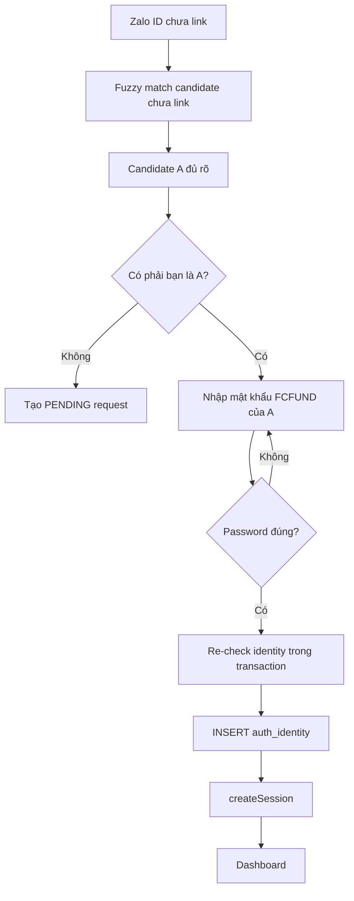
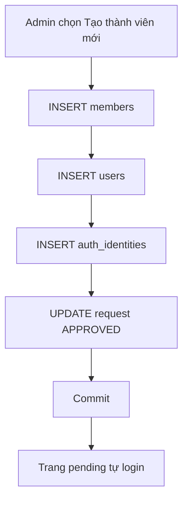
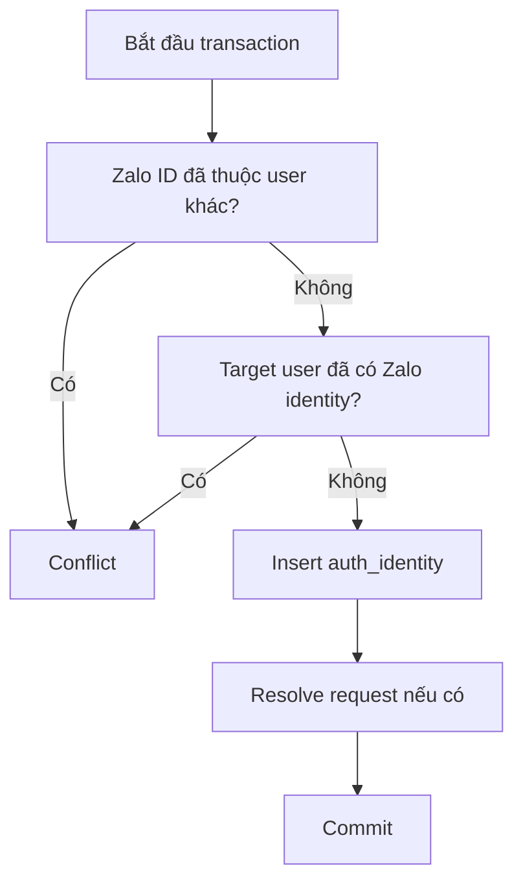
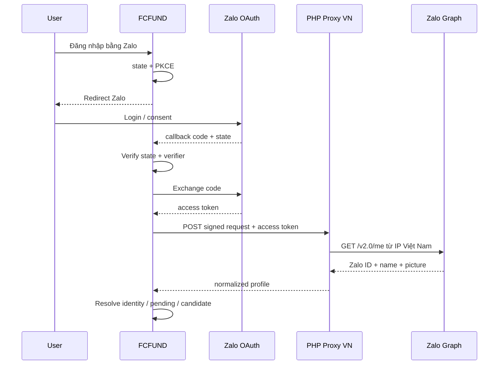
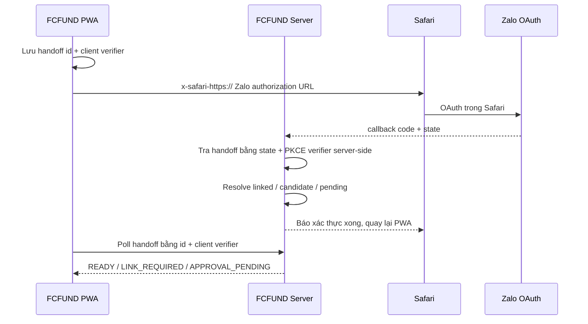

# Thiết kế đăng nhập Zalo cho PWA FCFUND

**Ngày cập nhật:** 2026-09-22
**Trạng thái:** Account linking + iOS PWA OAuth handoff đã triển khai trong source; chờ migration/deploy và kiểm thử production
**Deep link quản trị:** `/settings/zalo-requests`

## 1. Mục tiêu

FCFUND hỗ trợ hai cách đăng nhập:

- số điện thoại + mật khẩu FCFUND;
- Zalo OAuth sau khi Zalo identity đã được liên kết.

Zalo chỉ xác minh danh tính Zalo. FCFUND vẫn quyết định user, member, club, role, permission và trạng thái active.

## 2. Quy tắc đã chốt

1. Zalo ID đã link → resolve `users.id` → login.
2. Zalo ID chưa link → fuzzy-match **chỉ với user/member chưa có Zalo identity**.
3. Nếu match được một candidate đủ rõ → hỏi “Có phải bạn là thành viên A?”.
4. Nếu user xác nhận đúng → chỉ cần nhập mật khẩu của account candidate để link.
5. Nếu user bấm “Không phải tôi” → tạo request `PENDING` để Admin duyệt.
6. Nếu không match được tên → tạo request `PENDING` ngay.
7. Tất cả user có `role = ADMIN` (“Chủ Tịch Fifa”) được thông báo khi có request mới.
8. Request PENDING không tự hết hạn.
9. OAuth lại bằng cùng Zalo ID khi đã có PENDING → không tạo request mới; quay lại trang chờ.
10. Admin có thể:
   - link request vào một user hiện có chưa có Zalo identity;
   - tạo mới **member + user** rồi link Zalo ID vào user mới;
   - từ chối request.
11. Khi Admin duyệt, user đang ở trang chờ được tự động login và chuyển Dashboard.
12. Request bị từ chối hiển thị trạng thái REJECTED cho Zalo user.
13. Không overwrite một user đã link Zalo hoặc một Zalo ID đã thuộc user khác.

## 3. Luồng tổng thể

```mermaid
flowchart TD
    A[Đăng nhập bằng Zalo] --> B[OAuth thành công]
    B --> C[Lấy Zalo ID + tên + avatar]
    C --> D{Zalo ID đã link?}

    D -->|Có| E[Resolve users.id]
    E --> F{User active?}
    F -->|Có| G[createSession]
    G --> H[Dashboard]
    F -->|Không| I[Từ chối đăng nhập]

    D -->|Chưa| J{Đã có request PENDING?}
    J -->|Có| K[Khôi phục pending session]
    K --> L[/zalo/pending]

    J -->|Chưa| M[Lấy candidate chưa link Zalo]
    M --> N[Fuzzy match tên]

    N --> O{Có candidate đủ rõ?}
    O -->|Có| P[Hỏi: Có phải bạn là A?]
    P -->|Có| Q[Nhập mật khẩu account A]
    Q --> R{Mật khẩu đúng?}
    R -->|Có| S[Transaction link identity]
    S --> G
    R -->|Không| Q

    P -->|Không| T[Tạo request PENDING]
    O -->|Không| T

    T --> U[Thông báo tất cả ADMIN]
    T --> L
```

## 4. Candidate pool

Fuzzy matching **không được chạy trên toàn bộ member/user**.

Candidate phải thỏa:

- user active;
- user có `memberId`;
- member active;
- cùng club của Zalo login flow;
- user chưa có auth identity provider ZALO.

Ý tưởng query:

~~~sql
SELECT u.id, u.member_id, m.full_name
FROM users u
JOIN members m ON m.id = u.member_id
LEFT JOIN auth_identities ai
  ON ai.user_id = u.id
 AND ai.provider = 'ZALO'
WHERE u.club_id = :club_id
  AND u.is_active = true
  AND m.status = 'ACTIVE'
  AND ai.id IS NULL;
~~~

Thành viên có record member nhưng chưa có user không nằm trong candidate pool vì không có mật khẩu để xác minh. Trường hợp này đi qua Admin approval.

## 5. Matching tên

Tên chỉ dùng để tìm candidate, không dùng làm bằng chứng xác thực.

Thứ tự matching:

1. preset exact cho các tên Zalo đã biết của Trai Làng Stown, ánh xạ tới `members.code`;
2. nếu preset target không nằm trong candidate pool (ví dụ member chưa có user, user inactive hoặc đã link Zalo) → không fallback sang người khác, đi Admin approval;
3. nếu không có preset → fuzzy matching.

Chuẩn hóa fuzzy:

1. lowercase;
2. trim;
3. collapse whitespace;
4. bỏ dấu tiếng Việt;
5. chuẩn hóa Đ/đ;
6. bỏ ký tự đặc biệt;
7. so sánh chuỗi có thứ tự;
8. token-sorted;
9. bỏ khoảng trắng để nhận diện các dạng như `Vươngak ↔ Vương AK`;
10. token-subset khi tên có ít nhất hai token, để nhận diện các dạng thêm họ/từ mô tả như `Nguyễn Thanh Hải ↔ Thanh Hải` hoặc `Tuấn Decor Luxury ↔ Tuấn Luxury`.

Rule fuzzy:

~~~text
bestScore >= 0.90
AND
bestScore - secondScore >= 0.08
~~~

Nếu không đạt → Admin approval.

Nếu nhiều người cùng tên hoặc score gần nhau → không tự chọn.

Production test với 26 Zalo display name đã biết:

- matcher cũ: 7/26 tự match;
- fuzzy cải tiến, chưa preset: 13/26 tự match;
- fuzzy + preset: 18/26 tự match;
- 8/26 còn lại đều là member active nhưng chưa có user, nên đúng nghiệp vụ phải đi PENDING/Admin approval.

Preset chỉ chọn candidate. User vẫn phải xác nhận candidate và nhập đúng mật khẩu FCFUND trước khi tạo `auth_identities`.

## 6. Match thành công



Không cần nhập lại số điện thoại khi candidate đã được xác định.

## 7. Không match hoặc user phủ nhận candidate

Tạo `zalo_link_requests`:

~~~text
Zalo profile
→ provider_user_id
→ display_name
→ avatar_url
→ status = PENDING
~~~

Sau đó:

1. gửi Push tới tất cả active user có role ADMIN (nếu thiết bị Admin có Push subscription);
2. deep link notification tới `/settings/zalo-requests`;
3. đưa Zalo user tới `/zalo/pending`;
4. trang pending hiển thị “Đang chờ Chủ Tịch Fifa duyệt vào Liên đoàn”;
5. trang tự kiểm tra trạng thái định kỳ.

## 8. Trang chờ Zalo user

Route:

~~~text
/zalo/pending
~~~

Trang phải hoạt động khi user **chưa có FCFUND session**.

Trạng thái:

### PENDING

~~~text
Đang chờ Chủ Tịch Fifa duyệt

Tài khoản Zalo của bạn đã được ghi nhận.
Ban quản trị đang xác định thành viên tương ứng trong Liên đoàn.
Bạn có thể giữ trang này mở.
~~~

Client poll trạng thái khoảng 5–10 giây/lần.

### APPROVED

API poll:

1. đọc pending cookie đã ký;
2. xác nhận request APPROVED;
3. lấy `approved_user_id`;
4. kiểm tra user active;
5. gọi `createSession()`;
6. trả redirect `/dashboard`.

### REJECTED

~~~text
Yêu cầu liên kết Zalo đã bị từ chối.
Vui lòng liên hệ Chủ Tịch Fifa nếu cần hỗ trợ.
~~~

## 9. Re-login khi đang PENDING

```mermaid
flowchart TD
    A[OAuth cùng Zalo ID] --> B{auth_identity tồn tại?}
    B -->|Có| C[Login]
    B -->|Chưa| D{PENDING request tồn tại?}
    D -->|Có| E[Không tạo request mới]
    E --> F[Cấp lại pending cookie]
    F --> G[/zalo/pending]
    D -->|Không| H[Candidate matching]
```

Request PENDING không tự hết hạn.

## 10. Trang Chủ Tịch Fifa

Deep link:

~~~text
/settings/zalo-requests
~~~

Chỉ `role = ADMIN` được truy cập.

Danh sách request hiển thị:

- avatar Zalo;
- tên Zalo;
- Zalo ID;
- thời điểm tạo;
- trạng thái.

Với PENDING, Admin có ba lựa chọn:

### A. Link vào user hiện có

Danh sách chỉ gồm:

- cùng club;
- active;
- chưa có Zalo identity.

Admin chọn user → approve → tạo `auth_identities`.

### B. Tạo member + user mới

Dùng khi Zalo user là thành viên mới.

Admin nhập:

- mã thành viên (có thể tự sinh);
- họ tên (mặc định tên Zalo);
- số điện thoại;
- role user (mặc định MEMBER);
- ngày tham gia / ghi chú nếu cần.

Transaction:



User mới sử dụng mật khẩu mặc định của FCFUND làm fallback password theo policy hiện tại.

### C. Từ chối

Set:

~~~text
status = REJECTED
resolved_by = admin.id
resolved_at = now()
~~~

Trang pending nhận trạng thái và thông báo cho Zalo user.

## 11. Data model

### auth_identities

Chỉ chứa identity **đã xác định chắc chắn thuộc user nào**.

~~~text
auth_identities
────────────────────────────────
id
user_id
provider               ZALO
provider_user_id       Zalo user ID
display_name
avatar_url
linked_at
last_login_at
created_at
updated_at
~~~

Constraint:

~~~text
UNIQUE(provider, provider_user_id)
UNIQUE(user_id, provider)
~~~

### zalo_link_requests

Chứa identity chưa xác định / đang chờ Admin.

~~~text
zalo_link_requests
────────────────────────────────
id
club_id
provider_user_id
display_name
avatar_url
status                 PENDING / APPROVED / REJECTED
approved_user_id       nullable
resolved_by            nullable ADMIN
resolved_at            nullable
rejection_reason       nullable
created_at
updated_at
~~~

Constraint/index:

- chỉ một request PENDING cho cùng Zalo ID;
- index `club_id + status`;
- approved_user_id/resolved_by là FK users.

### zalo_auth_handoffs

Bridge ngắn hạn giữa Safari OAuth và PWA session:

```text
zalo_auth_handoffs
────────────────────────────────
id
client_secret_hash
oauth_state
pkce_verifier
status                 PENDING / LINK_REQUIRED / APPROVAL_PENDING / READY / CONSUMED / FAILED
provider_user_id       nullable
display_name           nullable
avatar_url             nullable
club_id                nullable
candidate_user_id      nullable
link_request_id        nullable
user_id                nullable
failure_message        nullable
expires_at
consumed_at
created_at
updated_at
```

`oauth_state` là unique. Client verifier thật không lưu DB; chỉ hash SHA-256 được lưu. PKCE verifier cần được server giữ tạm để callback Safari đổi authorization code sang access token.

## 12. Pending session bảo mật

Không đưa request ID trần ra làm credential.

FCFUND dùng HttpOnly signed cookie riêng cho pending flow.

Cookie chứa tối thiểu:

- request ID;
- Zalo provider user ID.

Thuộc tính:

~~~text
HttpOnly
Secure production
SameSite=Lax
Path=/
~~~

Cookie không phải FCFUND login session.

Khi OAuth lại với request PENDING, server có thể cấp lại pending cookie.

## 13. Candidate link context

Khi fuzzy match thành công nhưng chưa nhập password, FCFUND cần giữ Zalo profile + candidate an toàn qua redirect.

Dùng signed HttpOnly cookie ngắn hạn:

- Zalo ID;
- Zalo display name;
- avatar URL;
- candidate user ID;
- club ID.

Thời hạn khoảng 10 phút.

Không tin candidate ID gửi từ client nếu không đối chiếu cookie/server DB.

## 14. Race condition

Mọi link phải re-check trong transaction:



Unique constraint DB là lớp bảo vệ cuối.

## 15. OAuth



Zalo Graph giới hạn dữ liệu cá nhân theo IP Việt Nam. Production Vercel vì vậy dùng PHP proxy đặt tại Việt Nam cho riêng bước lấy profile. Request Vercel → proxy được ký HMAC-SHA256 theo timestamp + raw body và chỉ có hiệu lực trong khoảng 60 giây.

Access/refresh token không được lưu nếu chỉ dùng để login. PHP proxy cũng không log hoặc lưu access token.

### 15.1. iOS PWA → Safari handoff

Trên iOS, OAuth mở ngay trong Home Screen PWA không có cùng browser state với Safari, nên Zalo có thể không cung cấp luồng đăng nhập qua ứng dụng Zalo. Test production ngày 2026-09-22 xác nhận custom scheme `x-safari-https://...` có thể đưa navigation từ PWA sang Safari thật.

FCFUND dùng handoff server-side cho riêng iOS PWA:



Nguyên tắc:

- OAuth `state` + PKCE verifier của handoff nằm server-side trong DB; Safari không cần cookie OAuth của PWA.
- PWA giữ một client verifier riêng; DB chỉ giữ SHA-256 của client verifier.
- Handoff khởi tạo có TTL 10 phút; sau khi callback thành công, kết quả được giữ 30 phút để user quay lại PWA.
- Nếu Zalo ID đã link → poll trong PWA tạo `fcfund_session` trực tiếp trong PWA rồi vào Dashboard.
- Nếu cần xác nhận candidate → poll cấp lại signed `zalo_link_context` cookie ngay trong PWA rồi chuyển `/zalo/link`.
- Nếu cần Admin duyệt → poll cấp signed `zalo_pending` cookie ngay trong PWA rồi chuyển `/zalo/pending`.
- Browser Safari/Chrome bình thường vẫn dùng OAuth cookie flow cũ.
- `x-safari-https` là workaround iOS đã test thực tế nhưng không phải Web API chuẩn/documented của Apple; cần regression-test khi nâng iOS.

## 16. Notification

Event mới:

~~~text
ZALO_LINK_REQUEST
~~~

Recipients:

~~~text
users.role = ADMIN
AND users.isActive = true
AND users.clubId = request.clubId
~~~

Push:

~~~text
Có thành viên Zalo đang chờ duyệt
<Zalo display name> đang chờ Chủ Tịch Fifa xác nhận vào Liên đoàn.
~~~

Deep link:

~~~text
/settings/zalo-requests
~~~

Nếu Admin chưa đăng ký Push, request vẫn tồn tại và nhìn thấy trên trang quản trị.

## 17. Club resolution

OAuth xảy ra trước khi biết FCFUND user.

FCFUND deployment hiện phục vụ một liên đoàn/club chính. Server:

1. ưu tiên `ZALO_CLUB_ID` nếu được cấu hình;
2. nếu database chỉ có đúng một club thì tự dùng club đó;
3. nếu có nhiều club mà không cấu hình `ZALO_CLUB_ID`, từ chối Zalo linking để tránh link nhầm liên đoàn.

## 18. Các trường hợp bắt buộc test

| Trường hợp | Kết quả |
|---|---|
| Zalo ID đã link + user active | Login thẳng |
| Zalo ID đã link + user inactive | Từ chối |
| Chưa link + candidate rõ | Hỏi xác nhận + password |
| Candidate đúng + password đúng | Link + login |
| Candidate đúng + password sai | Không link |
| Candidate bị user phủ nhận | Tạo PENDING |
| Không candidate | Tạo PENDING |
| PENDING OAuth lại | Dùng request cũ |
| Admin link existing user | APPROVED |
| Admin tạo member + user | APPROVED |
| Admin reject | REJECTED |
| Target user vừa được link bởi request khác | Conflict |
| Zalo ID vừa được link bởi request khác | Conflict |
| Trang pending mở khi Admin approve | Tự login + Dashboard |
| iOS PWA mở Zalo OAuth | Chuyển sang Safari thật qua handoff |
| Safari callback của PWA handoff | Không phụ thuộc OAuth cookie của Safari/PWA |
| PWA quay lại sau linked-user OAuth | Poll handoff → tạo session trong PWA → Dashboard |
| PWA quay lại khi candidate rõ | Nhận link-context cookie trong PWA → /zalo/link |
| PWA quay lại khi cần Admin duyệt | Nhận pending cookie trong PWA → /zalo/pending |

## 19. Trạng thái triển khai

### Đã triển khai

- Zalo OAuth v4, state và PKCE;
- lấy Zalo ID/name/avatar;
- `auth_identities` và `zalo_link_requests`;
- candidate matcher chỉ xét user/member chưa link Zalo;
- xác nhận candidate bằng mật khẩu;
- nhánh “Không phải tôi” → PENDING;
- không match → PENDING;
- Push tới tất cả active ADMIN có Push subscription;
- deep link `/settings/zalo-requests`;
- trang `/zalo/pending`;
- OAuth lại khi PENDING dùng lại request cũ;
- Admin link vào user hiện có;
- Admin tạo member + user mới rồi link;
- Admin từ chối request;
- polling 5 giây và tự tạo session khi APPROVED;
- transaction + unique constraints chống link trùng;
- feature flag và `ZALO_CLUB_ID` cho club resolution;
- iOS PWA → Safari bằng `x-safari-https`;
- server-side OAuth handoff với state + PKCE;
- PWA poll handoff và tái tạo session/link-context/pending-context ngay trong PWA.

### Cần kiểm thử production

1. chạy migration `0017_sudden_captain_britain.sql` trên production trước khi deploy code mới;
2. iOS PWA → Safari → Zalo callback → quay lại PWA;
3. linked Zalo user nhận session trực tiếp trong PWA;
4. candidate rõ quay lại đúng `/zalo/link`;
5. PENDING quay lại đúng `/zalo/pending`;
6. OAuth trên Chrome/Android PWA;
4. fuzzy match với dữ liệu tên thành viên thật;
5. Push tới nhiều ADMIN;
6. approve existing user;
7. tạo member + user mới;
8. reject;
9. re-login khi PENDING;
10. race/conflict khi hai Admin xử lý cùng request.

## 20. Nguyên tắc cuối

> Zalo display name chỉ giúp tìm candidate. Zalo user ID là external identity. Khi không xác định chắc chắn user, quyền quyết định được chuyển cho tất cả Admin (“Chủ Tịch Fifa”) qua request PENDING.
