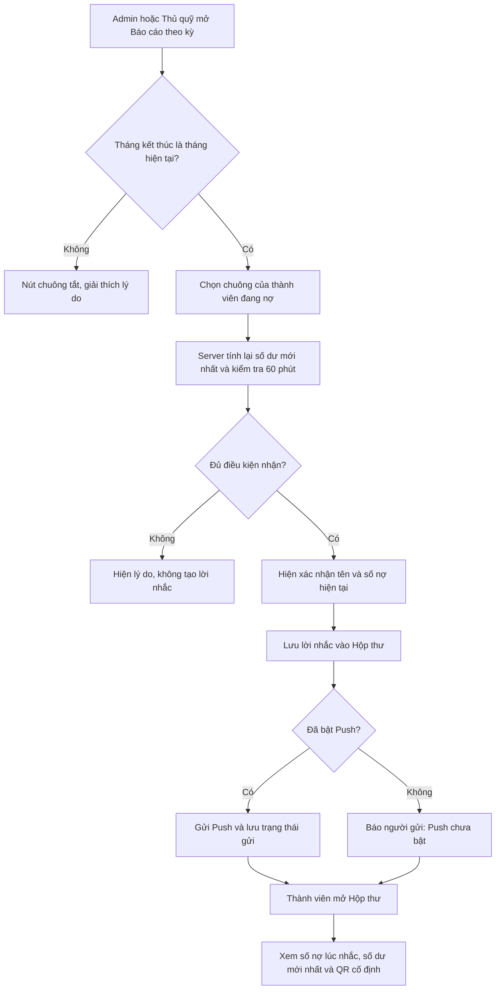

# Nhắc nợ theo kỳ và Hộp thư thông báo

**Trạng thái:** Đã triển khai giai đoạn đầu; phần nội dung thông báo kết quả trận/khoản thu được đặc tả bổ sung tại mục 6.
**Phạm vi:** Nhắc từng thành viên từ Báo cáo theo kỳ; xây Hộp thư chung để tài khoản xem lại các thông báo từ nhiều chức năng. Lời nhắc nợ có trang chi tiết công nợ và QR chuyển khoản cố định.

## 1. Quyết định nghiệp vụ đã chốt

- Admin và Thủ quỹ có thể nhắc nợ từng thành viên trong **Báo cáo theo kỳ**.
- Chỉ cho nhắc khi báo cáo đang xem có **tháng kết thúc là tháng hiện tại** theo múi giờ `Asia/Ho_Chi_Minh`. Báo cáo kết thúc ở tháng khác không cho nhắc.
- Số tiền nhắc là **số nợ mới nhất tính đến thời điểm bấm gửi trong tháng hiện tại**, không phải số nợ cũ của kỳ được mở trước đó.
- Thành viên được nhắc khi số dư cuối kỳ âm; số tiền nợ được biểu thị bằng giá trị tuyệt đối của số dư âm.
- Mỗi lần nhắc một thành viên dùng một nút hình chuông ở **cột thao tác cuối bảng, sticky bên phải khi cuộn ngang** trong List view hoặc **header của card** trong Card view. Không có thao tác gửi hàng loạt trong phạm vi này.
- Có thể nhắc lại cùng thành viên nhiều lần nhưng các lần **lưu lời nhắc hợp lệ** cách nhau ít nhất **60 phút**, kể cả khi Push chưa bật.
- Nếu thành viên có tài khoản liên kết nhưng chưa bật Push, lời nhắc vẫn được lưu vào Hộp thư. Người gửi thấy `Đã lưu vào Hộp thư, Push chưa bật`.
- Nội dung Push trên màn hình khóa không hiển thị số nợ hoặc thông tin tài chính chi tiết. Sau khi đăng nhập, thành viên thấy lời nhắc, thông tin nợ và QR chuyển khoản cố định; thành viên tự quyết định số tiền thực nộp.
- Quét QR hoặc mở lời nhắc không tạo giao dịch thu. Admin/Thủ quỹ vẫn ghi nhận tiền thực nhận như hiện nay.

## 2. Những gì code hiện có hỗ trợ

- `reports/page.tsx` đã tính Báo cáo theo kỳ bằng số dư trước kỳ + tiền đã nộp − phát sinh. Loại thu có cờ `reportNextMonthSnapshot` được dời sang tháng báo cáo kế tiếp.
- `report-collections.tsx` có List/Card và cho ẩn loại thu. Ở List view, việc ẩn loại thu **thay đổi phép tính số dư đang hiển thị**. Chức năng nhắc nợ cần xác định số dư chuẩn độc lập với tùy chọn cột của trình duyệt.
- `clubs` đã lưu `qrUrl`, tên ngân hàng, số tài khoản và chủ tài khoản. Ảnh QR được trả qua `/api/club-assets/qr` sau khi kiểm tra đăng nhập và club.
- `push_subscriptions` lưu thiết bị Push; `notification_events` lưu Hộp thư và trạng thái giao Push. Event được tạo cho User hợp lệ kể cả khi chưa bật Push; `read_at` lưu trạng thái đã đọc.
- Một thành viên có thể chưa có tài khoản User liên kết. User không có Member không thể nhận lời nhắc nợ cá nhân.

## 3. Điều kiện hiện nút và gửi

1. Nút chỉ xuất hiện cho Admin và Thủ quỹ có quyền nhắc nợ; thành viên và Người tổ chức không thấy. Đề xuất policy riêng `debt_reminders.send`, mặc định bật cho hai vai trò này. Server kiểm tra lại vai trò và policy khi xử lý.
2. Với chế độ **Khoảng tháng**, chỉ bật nút nếu `balanceToMonth` bằng tháng hiện tại. Với chế độ **Toàn bộ**, nút tắt vì không có tháng kết thúc được chọn rõ ràng; UI hướng dẫn chuyển sang khoảng tháng kết thúc ở tháng hiện tại.
3. Chỉ bật cho hàng có số dư cuối kỳ âm. Nếu người xem ẩn một số cột loại thu, nút vẫn phải dựa trên số dư chuẩn của **toàn bộ khoản phát sinh**; UI cần cho thấy số nợ dùng để gửi nếu nó khác số dư đang hiển thị.
4. Server tính lại số dư mới nhất cho member đang hoạt động, chỉ gồm dữ liệu của đúng club và không bị xóa. Khoản phát sinh phải có **tháng báo cáo hiệu lực không muộn hơn tháng hiện tại** và ngày phát sinh không muộn hơn hôm nay; giao dịch nộp tiền cũng phải có ngày không muộn hơn hôm nay. Không nhận số tiền nợ từ client.
5. Nếu số dư mới nhất không âm, trả thông báo “Thành viên hiện không còn nợ” và không tạo lời nhắc.
6. Nếu đội chưa có ảnh QR và thông tin tài khoản cần thiết, tắt nút và hướng dẫn Admin hoàn thiện cấu hình chuyển khoản.
7. Nếu lần lưu lời nhắc hợp lệ gần nhất của thành viên chưa đủ 60 phút, tắt nút và hiển thị thời điểm có thể nhắc lại, kể cả lần đó không gửi được Push. Server phải kiểm tra lại bằng transaction/khóa theo thành viên để hai cú bấm gần nhau không vượt giới hạn.
8. Nút bấm cần trạng thái đang gửi để tránh bấm lặp và thông báo kết quả rõ ràng. Xác nhận trước khi gửi cho biết tên thành viên và số nợ mới nhất.

> Báo cáo đang hiển thị có thể khác số dư mới nhất nếu có giao dịch vừa được ghi nhận, loại thu bị ẩn hoặc dòng có ngày tương lai. Số tiền xác nhận gửi phải là kết quả server vừa tính, kèm thời điểm tính.

Quy tắc tính tại lúc gửi:

```text
số dư đến kỳ hiện tại
  = tổng tiền thành viên đã nộp đến hôm nay
  − tổng khoản phát sinh đã ghi nhận đến hôm nay và có tháng báo cáo hiệu lực ≤ tháng hiện tại
nợ cần nhắc = max(0, −số dư đến kỳ hiện tại)
```

Khoản phát sinh tháng 9 được cấu hình tổng kết sang tháng 10 chưa thuộc số nợ để nhắc trong tháng 9. Khoản phát sinh tháng 8 được tổng kết sang tháng 9 thì đã thuộc số nợ tháng 9.

## 4. Luồng thao tác



## 5. Nội dung thành viên thấy

### Trên Push

Tiêu đề: `Nhắc đóng quỹ · <Tên đội>`  
Nội dung: `Bạn có khoản quỹ cần thanh toán. Mở ứng dụng để xem chi tiết.`

Push dẫn tới URL trung gian `/n/<reminderId>`, rồi chuyển vào `/notifications/<reminderId>`. Nếu chưa có phiên đăng nhập, sau khi đăng nhập bằng số điện thoại sẽ trở về đúng lời nhắc. Chỉ tài khoản đang liên kết với member nhận lời nhắc mới được xem.

### Trong Hộp thư và trang chi tiết

- Tên đội, kỳ được nhắc, ngày/giờ nhắc theo `Asia/Ho_Chi_Minh`, người gửi hoặc nhãn “Thủ quỹ đội”.
- **Số nợ tại lúc nhắc**: giữ nguyên để xem lại lịch sử.
- **Số dư mới nhất khi mở**: tính lại từ dữ liệu thật. Nếu đã nộp một phần hoặc hết nợ, hiển thị rõ thay đổi. Không dùng số tiền lịch sử làm chỉ dẫn thanh toán hiện tại.
- Ảnh QR cố định đang cấu hình, ngân hàng, số tài khoản, chủ tài khoản và nút sao chép số tài khoản. QR không tự điền số tiền.
- Ghi chú: `Bạn có thể chuyển số tiền phù hợp. Số dư được cập nhật sau khi Thủ quỹ/Admin ghi nhận tiền thực nhận.`
- Nếu QR/tài khoản đã đổi sau ngày nhắc, trang chi tiết dùng **cấu hình chuyển khoản hiện tại** và ghi rõ đây là thông tin nhận tiền hiện hành.
- Nếu nợ đã về 0 hoặc thành số dư dương, hiển thị trạng thái `Đã thanh toán/Không còn nợ`, vẫn giữ lời nhắc lịch sử.

## 6. Hộp thư thông báo chung

Đề xuất thêm biểu tượng chuông trên App Shell, badge đếm chưa đọc và trang `/notifications`. Hộp thư hiển thị **mọi thông báo nghiệp vụ đã gửi tới tài khoản**; nhắc nợ là một loại trong đó. Push chỉ là cách báo ra thiết bị, Hộp thư là nơi xem lại trong app.

Các loại thông báo đã có trong code nên được đưa vào Hộp thư khi triển khai:

| Nhóm | Sự kiện hiện có | Khi bấm vào |
|---|---|---|
| Trận đấu | Tạo, cập nhật, hủy trận; mời/xác nhận tham gia | Trận tương ứng hoặc danh sách trận |
| Đội hình và kết quả | Xác nhận đội; kết quả cá nhân theo thứ hạng, kèm khoản phạt nếu có | Kết quả và khoản thu mở **Báo cáo → Phát sinh theo tháng** đúng tháng hiệu lực |
| Quỹ | Khoản thu mới; tiền nộp đã ghi nhận; nhắc nợ mới | Khoản thu mở **Báo cáo → Phát sinh theo tháng**; nhắc nợ mở chi tiết nhắc nợ |
| Quản trị | Yêu cầu liên kết Zalo | Trang duyệt yêu cầu, chỉ với tài khoản có quyền |

Thông báo thử cho Admin phục vụ kiểm tra thiết bị; có thể ẩn khỏi Hộp thư chính hoặc gắn nhãn `Thử nghiệm` để không lẫn với thông báo nghiệp vụ.

- Danh sách mới nhất trước, mỗi item có icon/nhóm, tiêu đề, thời gian và trạng thái chưa đọc/đã đọc. Có thể lọc `Tất cả`, `Chưa đọc`, `Trận đấu`, `Quỹ`, `Quản trị`.
- Bấm item đánh dấu đã đọc và mở đích tương ứng. Nhắc nợ mở trang chi tiết có số nợ tại lúc nhắc, số dư mới nhất và QR. Có thể đánh dấu tất cả đã đọc; chưa cho xóa nhật ký nghiệp vụ ở giai đoạn đầu.
- Chỉ tài khoản nhận xem được event của mình. Với thông báo nhắc nợ, tài khoản cũng phải còn liên kết với đúng member. Admin/Thủ quỹ có màn hình theo dõi lần nhắc đã gửi và trạng thái Push, không được đọc Hộp thư riêng của thành viên qua route cá nhân.
- Hộp thư không phụ thuộc thiết bị Push: thông báo được lưu và xem lại sau khi đổi điện thoại, tắt Push hoặc đăng nhập lại. Tài khoản không có Member vẫn xem được thông báo dành cho User đó, ví dụ yêu cầu quản trị; chỉ các thông báo mang nghĩa cá nhân mới cần `member_id`.
- Thành viên chưa có User liên kết không thể có Hộp thư cá nhân; nút nhắc nợ báo rõ thiếu tài khoản liên kết.
- Thành viên có User liên kết nhưng chưa bật Push vẫn nhận lời nhắc trong Hộp thư; người gửi được báo riêng rằng Push chưa bật. Đây là trường hợp khác với chưa có tài khoản hoặc chưa đăng nhập.
- Các thông báo **đã gửi trước khi nâng cấp Hộp thư** chỉ có bản ghi với tài khoản từng bật Push. Không thể tự khôi phục chính xác những thông báo trước đây chưa từng được lưu.
- Khi ghi nhận kết quả, không gửi một thông báo chung “Kết quả trận đã cập nhật” và một thông báo phạt riêng. Mỗi thành viên nhận một thông báo kết quả phù hợp thứ hạng đội của mình; nếu bị phạt, khoản phạt nằm ngay trong nội dung đó.
- Tiêu đề thông báo kết quả là `Trận đấu đã kết thúc`. Nội dung nêu hạng (hạng 1 có lời chúc mừng) và khoản phạt nếu có. Trong Hộp thư, loại phạt có `reportAsIcon` hiển thị icon đã cấu hình lặp đúng số lượng; nếu không, hiển thị số lượng + tên khoản thu. Push màn hình khóa dùng chữ thuần làm phương án tương thích.
- Khoản thu thường phát sinh theo trận dùng tiêu đề `Khoản thu mới`, nội dung có tên khoản thu (ví dụ `Bạn có khoản thu “Trận lẻ” mới.`). Không áp dụng thông báo này thêm lần nữa cho khoản phạt đã được gắn vào thông báo kết quả.
- Link từ thông báo kết quả/khoản thu mở tab **Phát sinh theo tháng** và chọn đúng tháng báo cáo hiệu lực. Loại thu tổng kết qua tháng dùng tháng kế tiếp, phù hợp với cờ `reportNextMonthSnapshot`.
- `notification_events.presentation_data` lưu snapshot trình bày (hạng, tên loại thu, icon, màu, số lượng) để Hộp thư giữ nguyên nội dung/icon tại thời điểm phát sinh dù cấu hình sau này thay đổi. Đây là dữ liệu hiển thị, không phải nguồn tính công nợ.

## 7. Dữ liệu và giao hàng thông báo

Đề xuất bảng `debt_reminders` giữ bản ghi nghiệp vụ độc lập với kênh Push:

| Trường | Ý nghĩa |
|---|---|
| `id`, `club_id`, `member_id`, `recipient_user_id` | Định danh và phạm vi truy cập |
| `created_by_user_id`, `created_at` | Người thao tác và thời điểm nhắc |
| `report_from_month`, `report_to_month` | Khoảng tháng người gửi đang xem |
| `balance_snapshot`, `debt_amount_snapshot` | Số dư/số nợ server tính tại lúc gửi |
| `notification_events.entity_id` | Mục Hộp thư trỏ về `debt_reminders.id`; không cần khóa ngoại ngược |

- Chỉ insert một lời nhắc sau khi kiểm tra nợ, quyền, tài khoản User đang hoạt động liên kết với thành viên và giới hạn 60 phút. Dùng khóa giao dịch theo `(club_id, member_id)` hoặc cơ chế tương đương để chống hai request đồng thời.
- Bổ sung `read_at` cho `notification_events`. Sửa `notifyUsers` để tạo event cho **mọi User đang hoạt động được chọn nhận**, kể cả khi chưa có subscription Push; sau đó mới thử gửi Push cho thiết bị đã bật. Trạng thái `SKIPPED` nghĩa là không có Push hoặc cấu hình Push thiếu, **không** có nghĩa thông báo vắng khỏi Hộp thư.
- `notification_events` là nguồn dữ liệu chung của Hộp thư và giữ trạng thái vận chuyển Push (`PENDING`, `SENT`, `FAILED`, `SKIPPED`). `debt_reminders` giữ dữ liệu nghiệp vụ riêng như số nợ tại lúc nhắc, người thao tác và giới hạn 60 phút.
- `dedupe_key` của event dùng ID lời nhắc; một lần thao tác không tạo hai Push. Lần nhắc hợp lệ sau 60 phút là bản ghi mới.
- Không đưa số nợ hoặc QR vào Push payload hay nội dung chung của event. Server trả dữ liệu nhắc nợ chi tiết sau khi kiểm tra session, club và `recipient_user_id`/`member_id`. Các thông báo khác cũng kiểm tra quyền với tài nguyên đích khi mở.
- Khi lời nhắc đã lưu nhưng Push lỗi, UI của người gửi báo `Đã lưu vào Hộp thư, chưa gửi được Push` cùng trạng thái để xử lý tiếp.
- Chatter ghi ai nhắc ai, khi nào, nợ bao nhiêu tại lúc nhắc và kết quả Push; không xem thao tác này là khoản thu hay tiền đã nộp.

## 8. Tình huống cần xử lý

- Đang xem tháng 8 khi nay là tháng 9: nút tắt dù tháng 8 còn nợ. Chọn kỳ kết thúc ở tháng 9 để gửi.
- Đang xem tháng 8–9 khi tháng hiện tại là 9: có thể gửi; nợ được tính lại đến ngày bấm, gồm số dư từ các kỳ trước.
- Thành viên nộp tiền sau khi trang báo cáo mở: server tính lại. Nếu hết nợ thì không gửi; nếu còn nợ thì gửi số mới.
- Thành viên đang nợ 200.000 đ rồi nộp 100.000 đ: lời nhắc lịch sử vẫn ghi 200.000 đ, trang chi tiết hiển thị hiện còn 100.000 đ.
- Thành viên chưa có tài khoản User liên kết: không thể gửi Push/Hộp thư; thông báo ngay cho người bấm.
- Thành viên có tài khoản nhưng chưa bật Push: lưu lời nhắc trong Hộp thư, báo `Đã lưu vào Hộp thư, Push chưa bật` cho người gửi. Người nhận thấy mục mới khi đăng nhập/mở lại app.
- Người có tài khoản nhưng không liên kết Member: không thể nhận lời nhắc nợ cá nhân.
- Mất QR hoặc thông tin ngân hàng: hướng dẫn cấu hình trước khi nhắc; lời nhắc đã lưu vẫn xem được lịch sử.
- Thay đổi khoản thu thuộc loại tổng kết qua tháng: dùng `reportNextMonthSnapshot` và cùng hàm tính kỳ với báo cáo hiện tại.
- Khách truy cập `/public/report` không có nút nhắc nợ hoặc nội dung lời nhắc cá nhân.

## 9. Tiêu chí nghiệm thu

1. Nút chuông đúng vị trí ở List/Card, không xuất hiện trên trang công khai hay với người không có quyền.
2. Chỉ kỳ kết thúc ở tháng hiện tại được phép nhắc; kiểm tra lại trên server, không tin URL/client.
3. Chỉ người có nợ thật tại thời điểm bấm nhận lời nhắc, kể cả khi trang đang mở đã cũ.
4. Hai lần nhắc một thành viên trong 60 phút không tạo hai lời nhắc; sau 60 phút có thể nhắc lại nếu vẫn nợ.
5. Push không lộ số nợ; chi tiết và QR chỉ hiện sau khi đăng nhập đúng người.
6. Hộp thư còn lời nhắc sau khi tắt Push hoặc đổi thiết bị; xem được số nợ lúc nhắc và số dư mới nhất.
7. Hộp thư cũng lưu thông báo nghiệp vụ từ trận đấu, đội hình, kết quả, khoản thu và tiền nộp cho User nhận, dù User chưa bật Push.
8. Nhắc nợ không tự tạo `fund_transactions` hoặc thay đổi số dư.
