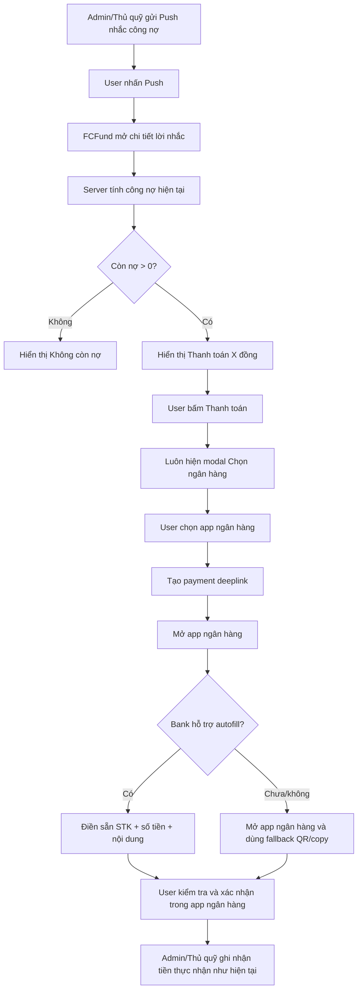
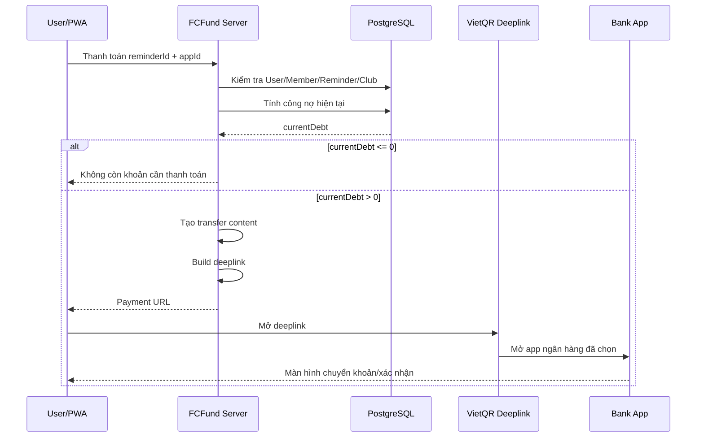
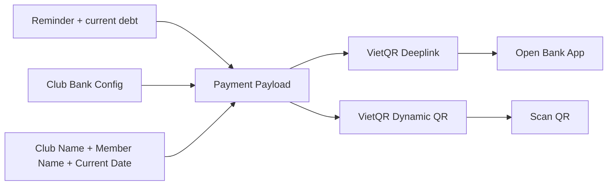
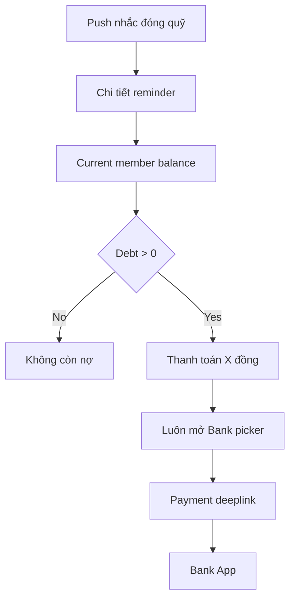

# Thanh toán công nợ bằng ứng dụng ngân hàng

**Trạng thái:** Phase 1 (deeplink) và Phase 2 (VietQR động) đã triển khai trong source. Migration `0019_lying_shiver_man` bổ sung `bankCode`/`bankBin` phải được áp dụng trước khi sử dụng tính năng thanh toán. Phase 3 (xác nhận thanh toán tự động) chưa triển khai.

**Phạm vi:** Trang chi tiết nhắc công nợ hỗ trợ `Thanh toán <số tiền>` → chọn ứng dụng ngân hàng → mở app ngân hàng qua VietQR deeplink, đồng thời sinh VietQR động theo current debt làm fallback. Sao chép số tài khoản vẫn được giữ làm phương án cuối.

## 1. Mục tiêu

Khi thành viên nhận Push nhắc công nợ và mở chi tiết lời nhắc, họ không cần tự chuyển sang app ngân hàng rồi nhập lại thông tin bằng tay.

Luồng mong muốn:

1. Thành viên mở Push/Hộp thư.
2. FCFund hiển thị số công nợ hiện tại.
3. Thành viên bấm **Thanh toán 350.000đ**.
4. FCFund hỏi **Bạn muốn dùng ngân hàng nào?**
5. Thành viên chọn app ngân hàng đang dùng, ví dụ MB Bank.
6. FCFund tạo VietQR deeplink chứa tài khoản nhận, số tiền và nội dung chuyển khoản.
7. Android/iOS mở app ngân hàng tương ứng.
8. Nếu app ngân hàng hỗ trợ autofill, thông tin chuyển khoản được điền sẵn.
9. Thành viên kiểm tra và xác nhận giao dịch trong app ngân hàng.
10. FCFund **không tự ghi nhận đã thanh toán** trong giai đoạn này; Admin/Thủ quỹ vẫn ghi nhận tiền thực nhận như hiện tại.

## 2. Quyết định nghiệp vụ đã chốt

### 2.1. CTA thanh toán

CTA chính trên trang chi tiết nhắc nợ đổi từ:

```text
[Sao chép số tài khoản]
```

thành:

```text
[Thanh toán 350.000đ]
```

Số tiền trên nút phải lấy từ **công nợ hiện tại khi mở trang**, không lấy cứng từ snapshot tại thời điểm gửi lời nhắc.

Ví dụ:

```text
Nợ tại lúc nhắc: 500.000đ
Hiện tại:         350.000đ

[ Thanh toán 350.000đ ]
```

Nếu thành viên không còn nợ:

```text
Hiện tại: Không còn nợ
```

thì không hiển thị CTA thanh toán.

### 2.2. Nội dung chuyển khoản

Nội dung chuyển khoản được tạo động theo mẫu:

```text
Tên Đội Bóng + Tên Thành Viên + DD-MM-YYYY
```

Trong đó **Tên Đội Bóng lấy trực tiếp từ `clubs.name`**, không hard-code `Trai Lang FC` trong source.

Cú pháp thực tế không chứa ký tự `+`; dấu `+` chỉ dùng để mô tả việc nối chuỗi.

Ví dụ:

```text
Trai Lang FC Nguyen Thanh Hai 10-09-2026
```

Quy tắc:

- Phần đầu lấy từ tên đội bóng hiện tại trong `clubs.name`.
- Tên thành viên lấy từ Member đang liên kết với User nhận lời nhắc.
- Ngày dùng định dạng `DD-MM-YYYY`.
- Ngày được tạo tại thời điểm thành viên bấm **Thanh toán**, theo múi giờ `Asia/Ho_Chi_Minh`.
- Khi truyền sang app ngân hàng, nội dung được chuẩn hóa để tương thích tốt hơn: bỏ dấu tiếng Việt, bỏ ký tự đặc biệt, ngày chuyển thành `DDMMYYYY`, giữ tối đa 40 ký tự.
- Ví dụ business content `Trai Lang FC Nguyễn Thanh Hải 23-09-2026` được truyền thành dạng tương thích ngân hàng như `Trai Lang FC Nguyen Thanh Hai 23092026` nếu nằm trong giới hạn.
- Nếu vượt giới hạn, phần tên đội/thành viên được rút gọn nhưng ngày vẫn được giữ.
- Không thêm reminder ID, user ID, mã giao dịch nội bộ hoặc dữ liệu kỹ thuật khác vào nội dung chuyển khoản.
- Client không được tự truyền tên thành viên hoặc số nợ tùy ý; dữ liệu thanh toán phải được dựng từ dữ liệu server đã xác thực.

> Cần test thực tế giới hạn độ dài/nội dung của từng app ngân hàng. Business content chuẩn vẫn là mẫu trên. Nếu provider/bank có giới hạn kỹ thuật khác, không được âm thầm thay đổi nội dung nghiệp vụ; cần có hàm chuẩn hóa được kiểm soát và test riêng.

## 3. Không cần menu ngân hàng riêng cho User

Không tạo thêm một trang Settings kiểu “Ngân hàng của tôi”.

Có hai khái niệm khác nhau:

### Ngân hàng nhận tiền của CLB

Được cấu hình một lần bởi Admin trong **Cài đặt → Thông tin đội bóng**.

Cấu hình thanh toán hiện tại của Club gồm:

```text
bankName
bankCode
bankBin
bankAccountNumber
bankAccountHolder
```

`qrUrl`/ảnh QR upload cũ có thể vẫn tồn tại như dữ liệu legacy trong Settings nhưng không còn là dependency của reminder/payment flow.

Trong đó:

- `bankCode`: mã ngân hàng dùng khi tạo deeplink/VietQR.
- `bankBin`: BIN 6 số để tạo VietQR động và tránh phụ thuộc text tên ngân hàng.

Không nên chỉ dùng `bankName` dạng text tự do cho tính năng thanh toán.

### Ngân hàng dùng để thanh toán của thành viên

Đây là **app ngân hàng trên thiết bị của User**, ví dụ:

- MB Bank
- Vietcombank
- BIDV SmartBanking
- VietinBank iPay
- ACB ONE
- OCB
- ...

**Quyết định đã chốt: mỗi lần User bấm Thanh toán đều phải hỏi lại dùng ngân hàng nào.**

Không lưu lựa chọn ngân hàng vào:

- Database.
- Cookie.
- localStorage.
- sessionStorage.
- Cache preference trên thiết bị.

Lý do là User có thể muốn dùng ngân hàng khác nhau cho từng lần chuyển khoản, và việc hỏi lại giúp họ chủ động chọn đúng app trước khi rời FCFund để sang ứng dụng ngân hàng.

## 4. Flow tổng thể



## 5. Flow UI đề xuất

### 5.1. Trang chi tiết nhắc công nợ

UI production hiện tại đi theo đúng thứ tự:

```text
Nhắc đóng quỹ

Nợ tại lúc nhắc
500.000đ

Hiện tại
Còn nợ 350.000đ

[ Thanh toán 350.000đ ]

──── Hoặc quét mã QR bên dưới ────

[ VietQR động - template LAZD3qS ]
QR đã gồm số tiền và nội dung chuyển khoản

──── Hoặc thanh toán theo STK ────

Ngân hàng
Số tài khoản
Chủ tài khoản

[ Sao chép số tài khoản ]

Ghi chú / trạng thái công nợ
```

QR được căn giữa panel. Nút sao chép là fallback cuối và có khoảng cách riêng với `.panel-note` để tránh chồng giao diện trên mobile.

### 5.2. Mỗi lần bấm Thanh toán

Mỗi lần User bấm **Thanh toán**, luôn hiện bottom sheet/modal để chọn ngân hàng:

```text
Thanh toán 350.000đ

Bạn muốn dùng ứng dụng ngân hàng nào?

[ MB Bank           ]
[ Vietcombank       ]
[ BIDV SmartBanking ]
[ VietinBank iPay   ]
[ ACB ONE           ]
[ ...               ]

Hủy
```

Danh sách app ngân hàng lấy từ API deeplink tương ứng với OS:

```text
Android → danh sách Android app deeplinks
iOS     → danh sách iOS app deeplinks
```

Danh sách nên có:

- Logo app.
- Tên app.
- Tên ngân hàng.
- `appId`.
- Deeplink base.

Không hard-code toàn bộ danh sách app ngân hàng vào component nếu có thể tránh.

### 5.3. Không ghi nhớ ngân hàng đã chọn

Sau khi User chọn ngân hàng và deeplink được mở:

- FCFund không lưu app ngân hàng vừa chọn.
- Lần thanh toán tiếp theo vẫn hiện lại bank picker.
- CTA luôn giữ dạng trung lập, ví dụ `Thanh toán 350.000đ`, không đổi thành `Thanh toán bằng MB Bank`.
- Không có nút hoặc trạng thái `Đổi ngân hàng`, vì ngân hàng luôn được chọn lại ở mỗi lần thanh toán.

## 6. Cấu trúc VietQR deeplink

Deeplink thanh toán hiện dùng dạng:

```text
https://dl.vietqr.io/pay
  ?app=<APP_ID>
  &ba=<ACCOUNT_NO>@<BANK_CODE>
  &am=<AMOUNT>
  &tn=<TRANSFER_CONTENT>
  &bn=<ACCOUNT_HOLDER>
  &url=<RETURN_URL>
```

Ví dụ khái niệm:

```text
app = mb
ba  = 0123456789@mb
am  = 350000
tn  = <club.name> <member.name> 10-09-2026
bn  = NGUYEN VAN A
url = https://www.trailang.io.vn/notifications/<reminderId>
```

Ý nghĩa:

| Tham số | Nguồn dữ liệu |
|---|---|
| `app` | App ngân hàng User chọn |
| `ba` | STK nhận tiền + bank code của CLB |
| `am` | Công nợ hiện tại |
| `tn` | Nội dung chuyển khoản cố định |
| `bn` | Chủ tài khoản nhận tiền |
| `url` | URL quay về chi tiết reminder |

Luôn truyền đầy đủ các tham số ngay cả khi một số ngân hàng hiện chỉ hỗ trợ mở app mà chưa autofill. Khi app ngân hàng nâng cấp hỗ trợ autofill, FCFund không cần đổi cách tạo link.

## 7. Dữ liệu thanh toán phải được dựng từ server

Không tạo toàn bộ deeplink từ các giá trị client có thể sửa.

Route production đã triển khai:

```text
GET /api/payments/debt-reminder/<reminderId>?app=mb
```

Route test tương ứng:

```text
GET /api/payments/debt-reminder-test/<notificationEventId>?app=mb
```

Server thực hiện:

1. Xác thực User.
2. Xác thực reminder thuộc đúng club.
3. Xác thực reminder thuộc Member đang liên kết với User.
4. Tính lại số dư hiện tại.
5. Nếu không còn nợ → không tạo payment link.
6. Đọc cấu hình ngân hàng hiện tại của Club.
7. Tạo nội dung chuyển khoản.
8. Validate app ngân hàng được phép.
9. Build deeplink.
10. Trả URL hoặc redirect sang VietQR deeplink.



## 8. Hàm tạo nội dung chuyển khoản — Đã triển khai

Helper server-side:

```ts
buildDebtTransferContent({
  clubName,
  memberName,
  paymentDate,
})
```

Kết quả:

```text
<clubName> <memberName> DD-MM-YYYY
```

Ví dụ:

```text
Trai Lang FC Nguyen Thanh Hai 10-09-2026
```

Ngày phải dùng timezone ứng dụng:

```text
Asia/Ho_Chi_Minh
```

Không dùng UTC trực tiếp để tránh trường hợp gần nửa đêm sinh sai ngày.

## 9. VietQR động làm fallback — Đã triển khai

Trang reminder không còn phụ thuộc ảnh QR upload tĩnh. QR thanh toán được tạo động từ Quick Link VietQR và dùng **custom template `LAZD3qS`**.

Cú pháp:

```text
https://img.vietqr.io/image/<BANK_BIN>-<ACCOUNT_NO>-LAZD3qS.png
  ?amount=<AMOUNT>
  &addInfo=<TRANSFER_CONTENT>
  &accountName=<ACCOUNT_HOLDER>
```

QR động dùng cùng:

- Bank/BIN nhận tiền.
- STK nhận tiền.
- Số công nợ hiện tại.
- Nội dung chuyển khoản đã chuẩn hóa.
- Chủ tài khoản.
- Template VietQR `LAZD3qS`.

Route QR production tự xác thực User/Member/Reminder và tự tính lại current debt:

```text
/api/payments/debt-reminder/<reminderId>/qr
```

Route QR test chỉ chấp nhận event `DEBT_REMINDER_TEST` và cố định số tiền **1.000đ**:

```text
/api/payments/debt-reminder-test/<notificationEventId>/qr
```

UI reminder theo thứ tự:

```text
Thanh toán X đồng
→ Hoặc quét mã QR bên dưới
→ VietQR động, căn giữa
→ Hoặc thanh toán theo STK
→ Thông tin ngân hàng/STK/chủ tài khoản
→ Sao chép số tài khoản
```

Không thêm nút tải QR riêng. QR là ảnh PNG hiển thị trực tiếp; trên mobile User có thể nhấn giữ để lưu/chia sẻ ảnh nếu trình duyệt/PWA cho phép. Nếu app ngân hàng hỗ trợ đọc QR từ thư viện ảnh, User có thể dùng ảnh đã lưu; khả năng này phụ thuộc từng app ngân hàng.

Như vậy deeplink và QR luôn cùng dữ liệu:



Payment payload logic nên chỉ có một nguồn để tránh trường hợp QR ghi 350.000đ nhưng deeplink lại ghi 500.000đ.

## 10. Cấu hình Admin — Đã triển khai

Không tạo menu mới. Section **Thông tin đội bóng** trong Settings là nơi cấu hình tài khoản nhận tiền.

Luồng hiện tại:

```text
Ngân hàng nhận tiền: [select từ danh sách VietQR]
Bank Code:           server tự lưu theo ngân hàng đã chọn
BIN:                 server tự lưu theo ngân hàng đã chọn
Số tài khoản:        <text>
Chủ tài khoản:       <text>
```

Admin chỉ chọn ngân hàng từ dữ liệu chuẩn VietQR. Khi lưu, server xác thực lại mã ngân hàng và tự đồng bộ `bankName`, `bankCode`, `bankBin`.

Nếu Club chỉ còn `bankName` legacy nhưng chưa có `bankCode`/`bankBin`, Admin phải chọn lại ngân hàng trước khi deeplink/QR động được bật.

Không có yêu cầu phải upload ảnh QR tĩnh để gửi reminder hoặc sử dụng payment flow.

## 11. Data model hiện tại

Các field thanh toán của `clubs` đang dùng:

```text
bankName
bankCode
bankBin
bankAccountNumber
bankAccountHolder
qrUrl          # legacy, không dùng cho QR động của reminder
```

`bankCode` và `bankBin` được thêm bằng migration:

```text
drizzle/0019_lying_shiver_man.sql
```

Điều kiện `paymentReady` hiện tại là phải có đủ:

```text
bankCode
bankBin
bankAccountNumber
bankAccountHolder
```

`qrUrl` không còn tham gia điều kiện này.

Không cần thêm vào `users` bất kỳ trường nào để lưu app ngân hàng thanh toán.

Cũng không cần schema/client model kiểu:

```text
preferredBankApp
```

FCFund chỉ dùng `appId` trong đúng thao tác thanh toán hiện tại để build deeplink, sau đó bỏ lựa chọn này. Mỗi lần thanh toán mới sẽ yêu cầu User chọn lại ngân hàng.

## 12. Hành vi trên Android và iOS

### Android

Ưu tiên:

```text
PWA
→ click Thanh toán
→ chọn MB Bank
→ HTTPS VietQR deeplink
→ Android mở MB Bank
```

Nếu thiết bị không cài app đã chọn:

- Deeplink có thể không mở được app mong muốn.
- User vẫn đang có fallback QR và thông tin tài khoản trong FCFund.
- Không được đánh dấu thanh toán chỉ vì đã click link.

### iOS

Để giảm lỗi chuyển từ PWA/WebView sang app ngân hàng, khi User chọn ngân hàng trên iOS, FCFund không điều hướng trực tiếp từ PWA sang VietQR.

Luồng:

```text
PWA
→ Thanh toán
→ chọn app ngân hàng
→ PWA gọi server lấy payment URL đã kiểm tra
→ mở payment URL bằng Safari qua x-safari-https
→ Safari mở VietQR deeplink
→ bank app
```

Như vậy phần xác thực/reminder/current debt vẫn được xử lý trong phiên PWA hiện tại, còn bước mở deeplink ngân hàng được chuyển sang Safari. Danh sách app/deeplink phải dùng tập dữ liệu dành riêng cho iOS.

### Kiểm tra thông báo / Thử nhắc nợ

Luồng **Kiểm tra thông báo → Thử nhắc nợ** cũng dùng bank picker và VietQR deeplink thật để kiểm tra end-to-end.

Quy tắc riêng của chế độ test:

- Số tiền deeplink luôn cố định ở **1.000đ**.
- Không lấy công nợ thật của User.
- Không tạo hoặc cập nhật `MEMBER_PAYMENT`.
- Không thay đổi số dư/công nợ trong FCFund.
- Mỗi lần bấm **Thanh toán thử 1.000đ** vẫn luôn hỏi chọn ngân hàng.
- App ngân hàng được mở thật; giao dịch ngân hàng chỉ xảy ra nếu User tiếp tục xác nhận trong app ngân hàng.
- Nội dung chuyển khoản vẫn dùng cùng format production:
  `<Tên Đội Bóng> <Tên Thành Viên> DD-MM-YYYY`.
- Nếu tài khoản test chưa liên kết Member, tên hiển thị của User được dùng làm fallback cho phần tên trong nội dung chuyển khoản.
- UI phải cảnh báo rõ đây là deeplink thật với số tiền 1.000đ để tránh User vô tình xác nhận giao dịch.

Route triển khai:

```text
/api/payments/debt-reminder-test/<notificationEventId>?app=<appId>
```

Route chỉ chấp nhận event `DEBT_REMINDER_TEST` thuộc đúng User/Club đang đăng nhập và không nhận amount từ client.

### Khả năng autofill theo app ngân hàng

Không phải app nào trong danh sách deeplink cũng hỗ trợ mở thẳng màn hình chuyển khoản và điền sẵn dữ liệu.

Theo changelog VietQR tại thời điểm triển khai, các app đã công bố hỗ trợ autofill gồm:

- MBBank (`mb`).
- VietinBank iPay (`icb`).
- BIDV SmartBanking (`bidv`).
- ACB ONE (`acb`).
- OCB (`ocb`).

Vietcombank hiện chỉ được VietQR mô tả ở mức mở ứng dụng; không đảm bảo tự điền người nhận/số tiền/nội dung hoặc mở đúng màn hình chuyển khoản.

Phải phân biệt hai capability:

```text
Vietcombank deeplink
→ có thể chỉ mở VCB Digibank
→ không đảm bảo mở màn hình chuyển khoản
→ không đảm bảo autofill STK/số tiền/nội dung

VietQR động
→ chứa STK + amount + addInfo + accountName
→ là fallback ưu tiên khi deeplink không autofill
```

Với VCB, User nên ưu tiên QR động nếu cần đảm bảo số tiền và nội dung đã được đóng gói sẵn trong mã QR.

UI bank picker phải hiển thị rõ:

```text
Hỗ trợ điền sẵn thông tin
```

hoặc:

```text
Chỉ mở ứng dụng ngân hàng
```

để User không hiểu nhầm.

## 13. Trạng thái và lỗi cần xử lý

### Club chưa cấu hình ngân hàng

Không hiển thị CTA thanh toán.

Hiển thị:

```text
Thông tin chuyển khoản chưa được cấu hình đầy đủ.
Vui lòng liên hệ Thủ quỹ/Admin.
```

### Club có bankName nhưng thiếu bankCode/BIN

Không build deeplink bằng cách đoán từ text.

Admin phải chọn lại ngân hàng từ danh sách chuẩn.

### Không còn nợ

Không tạo link.

```text
Bạn hiện không còn khoản cần thanh toán.
```

### Chọn ngân hàng thanh toán

Mỗi lần User bấm **Thanh toán** đều mở bank picker, kể cả ngay trước đó User vừa thanh toán bằng một ngân hàng cụ thể.

Không có fast path dựa trên lựa chọn cũ.

### App ngân hàng đã chọn bị gỡ khỏi thiết bị

Deeplink không đảm bảo mở thành công.

FCFund vẫn giữ:

- QR.
- STK.
- Tên chủ tài khoản.
- Nút sao chép.

### API danh sách app ngân hàng lỗi

Có thể:

1. Dùng cache danh sách ngân hàng/app gần nhất trên server.
2. Nếu không có cache, giữ QR/copy fallback.
3. Không chặn toàn bộ trang reminder.

### VietQR Image/Quick Link lỗi

Nếu `img.vietqr.io` hoặc Quick Link không tải được ảnh QR:

- Trang reminder vẫn phải render được.
- Thông tin ngân hàng/STK/chủ tài khoản vẫn hiển thị.
- Nút **Sao chép số tài khoản** vẫn hoạt động.
- Deeplink vẫn có thể dùng nếu API deeplink còn hoạt động.
- Không được coi lỗi tải QR là bằng chứng payment flow thất bại hoàn toàn.

## 14. Bảo mật và tính đúng dữ liệu

- Không tin `amount` từ client.
- Không tin `memberName` từ client.
- Không tin bank nhận tiền từ client.
- `appId` do client chọn nhưng phải validate với danh sách app hỗ trợ.
- Server luôn tính lại current debt.
- Server luôn kiểm tra reminder/user/member/club.
- Payment deeplink không phải bằng chứng thanh toán.
- Không tự cập nhật `MEMBER_PAYMENT` khi User chỉ mở app ngân hàng.
- Không lưu access token hay credential ngân hàng.
- Không tích hợp login internet banking.
- User tự kiểm tra và xác nhận giao dịch trong app ngân hàng.
- Deeplink/Quick Link gửi một số dữ liệu thanh toán cần thiết qua URL của VietQR, gồm STK nhận, số tiền, tên chủ tài khoản và nội dung chuyển khoản. Không đưa credential, token, password hoặc dữ liệu xác thực ngân hàng vào URL.
- QR route production/test đều dựng payload từ dữ liệu server; client không được truyền `amount`, STK nhận hoặc tên người nhận để thay đổi payload.

## 15. Quan hệ với Push công nợ hiện tại

Không cần đổi logic gửi Push.

Push vẫn dẫn tới reminder:

```text
Push
→ /notifications/<reminderId>
→ currentMemberBalances()
→ hiện số nợ mới nhất
→ CTA Thanh toán
```

Điểm thay đổi nằm ở action trong trang reminder.



## 16. Các file đang triển khai tính năng

Các file chính hiện tại:

- `src/app/(app)/notifications/[id]/page.tsx`
  - trang reminder thật; hiển thị current debt, CTA thanh toán, QR động và thông tin STK.
- `src/app/(app)/notifications/demo/[id]/page.tsx`
  - trang reminder test; số tiền test cố định 1.000đ.
- `src/components/debt-payment-button.tsx`
  - CTA thanh toán + bank picker; tự phát hiện Android/iOS; iOS mở Safari trước khi chuyển sang VietQR.
- `src/components/copy-bank-account.tsx`
  - fallback sao chép STK.
- `src/lib/vietqr.ts`
  - danh sách bank/app VietQR, normalize nội dung, build deeplink và Quick Link QR.
- `src/app/api/payments/bank-apps/route.ts`
  - trả danh sách app ngân hàng theo platform.
- `src/app/api/payments/debt-reminder/[id]/route.ts`
  - payment deeplink production.
- `src/app/api/payments/debt-reminder-test/[id]/route.ts`
  - payment deeplink test.
- `src/app/api/payments/debt-reminder/[id]/qr/route.ts`
  - QR production; xác thực reminder/User/Member và tính lại current debt.
- `src/app/api/payments/debt-reminder-test/[id]/qr/route.ts`
  - QR test; amount cố định 1.000đ.
- `src/app/(app)/settings/page.tsx`
  - chọn ngân hàng nhận tiền từ danh sách VietQR.
- `src/app/(app)/mutations.ts`
  - validate và lưu `bankName`/`bankCode`/`bankBin`.
- `src/db/schema.ts`
  - schema Club payment fields.
- `src/lib/current-member-balance.ts`
  - nguồn current debt.
- `src/app/globals.css`
  - layout QR/bank picker/divider/copy-button spacing.
- `drizzle/0019_lying_shiver_man.sql`
  - migration thêm `bank_code` và `bank_bin`.

Không có file `bank-app-picker.tsx` riêng; bank picker hiện nằm trong `debt-payment-button.tsx`.

## 17. Roadmap triển khai

### Phase 1 — Deeplink thanh toán — Đã triển khai

- Đã thêm `bankCode`, `bankBin` bằng migration `0019_lying_shiver_man`.
- Settings ngân hàng dùng danh sách chuẩn từ VietQR; server xác thực lại ngân hàng khi lưu.
- Đã tạo helper payment payload/deeplink trong `src/lib/vietqr.ts`.
- Đã tạo bank app picker lấy đúng danh sách Android/iOS từ VietQR.
- Mỗi lần thanh toán luôn mở bank picker; không lưu preferred bank app.
- Đã tạo route thanh toán theo reminder, tính lại current debt ở server trước khi redirect.
- CTA reminder đổi thành `Thanh toán X đồng` khi cấu hình ngân hàng mới đầy đủ.
- QR và sao chép số tài khoản vẫn giữ làm fallback.

### Phase 2 — QR động — Đã triển khai

- Không phụ thuộc ảnh QR upload cố định.
- Dùng custom template VietQR `LAZD3qS`.
- QR production lấy current debt mới nhất từ server.
- QR test cố định amount **1.000đ**.
- QR dùng cùng STK/chủ tài khoản/transfer content với payment flow.
- QR production route không nhận amount từ client.
- QR test route không nhận amount từ client.
- QR được căn giữa trong reminder.
- UI theo thứ tự: CTA thanh toán → QR động → thông tin STK → sao chép STK.
- `qrUrl` legacy có thể tiếp tục tồn tại trong Settings nhưng không còn bắt buộc.
- Có thể nhấn giữ ảnh QR để lưu/chia sẻ; không thêm nút download riêng.

### Phase 3 — Xác nhận thanh toán tự động

Ngoài phạm vi tài liệu này.

Có thể nghiên cứu sau:

- Payment request riêng.
- Webhook/provider confirmation.
- Mapping giao dịch nhận tiền về Member.
- Tự đề xuất/tạo `MEMBER_PAYMENT`.
- Chống duplicate webhook.
- Reconciliation cho Admin/Thủ quỹ.

Không triển khai Phase 3 cùng Phase 1 để tránh làm phức tạp feature mở app ngân hàng.

## 18. Tiêu chí hoàn thành Phase 1 + Phase 2

Feature được xem là đạt khi:

1. Admin chọn được ngân hàng nhận tiền bằng dữ liệu chuẩn và lưu đủ `bankCode` + `bankBin`.
2. Reminder còn nợ hiển thị đúng `Thanh toán <current debt>`.
3. Mỗi lần click Thanh toán đều hỏi app ngân hàng.
4. Không lưu app ngân hàng đã chọn vào DB, cookie, localStorage hoặc sessionStorage.
5. Sau khi User chọn ngân hàng, FCFund tạo deeplink cho đúng app của lần thanh toán đó.
6. Deeplink chứa đúng STK nhận tiền và current debt.
7. Business content lấy từ `clubs.name` + tên Member + ngày; payload gửi bank được normalize ASCII, bỏ ký tự đặc biệt và giới hạn độ dài.
8. Android mở deeplink trực tiếp; iOS lấy payment URL từ server rồi mở qua Safari trước khi sang VietQR/bank app.
9. UI bank picker phân biệt app có autofill và app chỉ mở ứng dụng.
10. Vietcombank không được mô tả như thể chắc chắn autofill; QR động là fallback ưu tiên khi deeplink VCB chỉ mở app.
11. QR production dùng template `LAZD3qS`, current debt hiện tại và transfer content server-side.
12. QR test dùng template `LAZD3qS` và amount cố định 1.000đ.
13. QR production/test không nhận amount tùy ý từ client.
14. UI reminder đúng thứ tự: Thanh toán → QR động → STK → Sao chép STK.
15. QR được căn giữa và nút copy không chồng `.panel-note` trên mobile.
16. Nếu QR provider lỗi, STK/copy fallback vẫn dùng được.
17. Không tạo transaction FCFund chỉ vì User đã click Thanh toán hoặc mở app ngân hàng.
18. Không có dữ liệu payment quan trọng nào được tin trực tiếp từ client.
19. `qrUrl` tĩnh không còn là điều kiện để reminder/payment hoạt động.

## 19. Nguồn kỹ thuật tham khảo

Thiết kế deeplink/QR dựa trên tài liệu chính thức VietQR:

- Deeplink App ngân hàng: https://www.vietqr.io/danh-sach-api/deeplink-app-ngan-hang/
  - Tài liệu hiện ghi rõ ví dụ Vietcombank chỉ mở app và chưa tự động điền người nhận/số tiền.
- VietQR Quick Link: https://www.vietqr.io/en/danh-sach-api/link-tao-ma-nhanh/
  - Cú pháp `https://img.vietqr.io/image/<BANK_ID>-<ACCOUNT_NO>-<TEMPLATE>.png`.
  - Hỗ trợ `amount`, `addInfo`, `accountName` và custom template.
- VietQR Intro / custom template: https://vietqr.io/intro/
  - Custom template được dùng bằng cách thay `<TEMPLATE>` bằng ID template đã tạo trên My VietQR.
- API danh sách ngân hàng: https://vietqr.io/danh-sach-api/api-danh-sach-ma-ngan-hang/
  - Endpoint: `GET https://api.vietqr.io/v2/banks`.
- Android app deeplink endpoint: `https://api.vietqr.io/v2/android-app-deeplinks`.
- iOS app deeplink endpoint: `https://api.vietqr.io/v2/ios-app-deeplinks`.
- VietQR changelog: https://vietqr.io/changelog/
  - Dùng để theo dõi từng app ngân hàng được bổ sung autofill.

Các API/provider là dependency bên ngoài. Khi thay đổi implementation hoặc capability matrix, cần kiểm tra lại response schema thực tế và changelog VietQR ở thời điểm đó; không giả định một bank đang hỗ trợ autofill chỉ vì bank đó có mặt trong danh sách deeplink.
